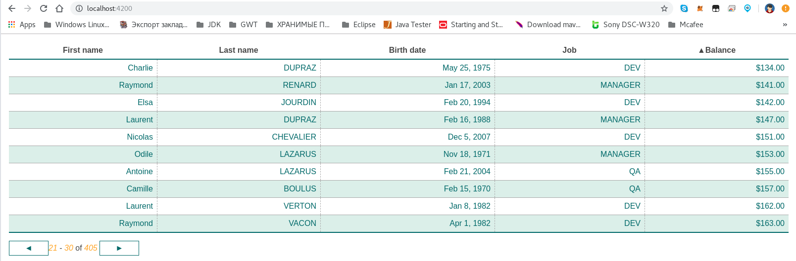

#Angular Material Data Table (Server Pagination, Filtering, Sorting)

* https://blog.angular-university.io/angular-material-data-table
* [Github Repo](https://github.com/angular-university/angular-material-course/tree/2-data-table-finished)

# To Run the Development Backend-Server

We can start the sample application backend with the following command:

    npm run server

This is a small Node REST API server.

# To run the Development UI-Server

To run the frontend part of our code, we will use the Angular CLI:

    npm start

The application is visible at port 4200, but you need to use HTTPS - [https://localhost:4200](https://localhost:4200)

This application uses a self-signed certificate, so you will need to accept it using the browser. If you are using Chrome, you will need to click Advanced and then choose "Proceed to localhost".

## Angular Material Course

This repository contains the code of the [Angular Material Course](https://angular-university.io/course/angular-material-course).

This course repository is updated to Angular v8, and there is a  package-lock.json file available, for avoiding semantic versioning installation issues.

# Important

This repository has multiple branches, have a look at the beginning of each section to see the name of the branch.

At certain points along the course, you will be asked to checkout other remote branches other than master. You can view all branches that you have available remotely using the following command:

    git branch -a

  The remote branches have their starting in origin, such as for example section-1.

We can checkout the remote branch and start tracking it with a local branch that has the same name, by using the following command:

      git checkout -b section-1 origin/section-1

It's also possible to download a ZIP file for a given branch,  using the branch dropdown on this page on the top left, and then selecting the Clone or Download / Download as ZIP button.

# Other Courses

# Angular PWA Course

If you are looking for the [Angular PWA Course](https://angular-university.io/course/angular-pwa-course), the repo with the full code can be found here:

# Angular Security Masterclass

If you are looking for the [Angular Security Masterclass](https://angular-university.io/course/angular-security-course), the repo with the full code can be found here:

[Angular Security Masterclass](https://github.com/angular-university/angular-security-course).

# Angular Advanced Library Laboratory Course

If you are looking for the Angular Advanced Course, the repo with the full code can be found here:

[Angular Advanced Library Laboratory Course: Build Your Own Library](https://angular-university.io/course/angular-advanced-course).

## RxJs and Reactive Patterns Angular Architecture Course

If you are looking for the RxJs and Reactive Patterns Angular Architecture Course code, the repo with the full code can be found here:

[RxJs and Reactive Patterns Angular Architecture Course](https://angular-university.io/course/reactive-angular-architecture-course)

## Angular Ngrx Reactive Extensions Architecture Course

If you are looking for the Angular Ngrx Reactive Extensions Architecture Course code, the repo with the full code can be found here:

[Angular Ngrx Reactive Extensions Architecture Course](https://angular-university.io/course/angular2-ngrx)

[Github repo for this course](https://github.com/angular-university/ngrx-course)

## Angular 2 and Firebase - Build a Web Application Course

If you are looking for the Angular 2 and Firebase - Build a Web Application Course code, the repo with the full code can be found here:

[Angular 2 and Firebase - Build a Web Application](https://angular-university.io/course/build-an-application-with-angular2)

[Github repo for this course](https://github.com/angular-university/angular-firebase-app)

## Complete Typescript 2 Course - Build A REST API

If you are looking for the Complete Typescript 2 Course - Build a REST API, the repo with the full code can be found here:

[https://angular-university.io/course/typescript-2-tutorial](https://github.com/angular-university/complete-typescript-course)

[Github repo for this course](https://github.com/angular-university/complete-typescript-course)

